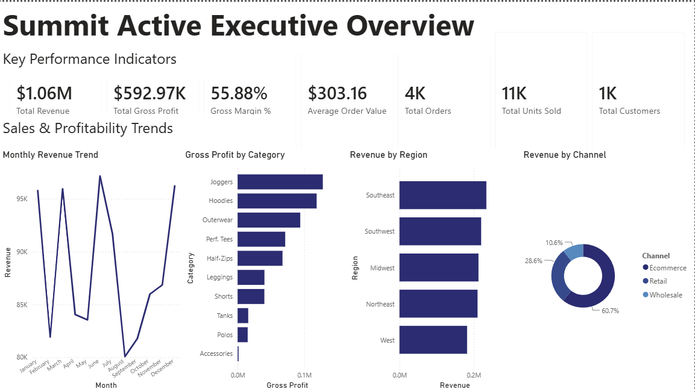
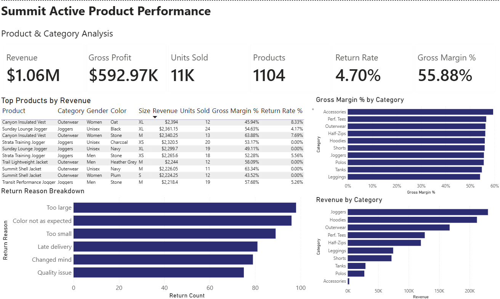
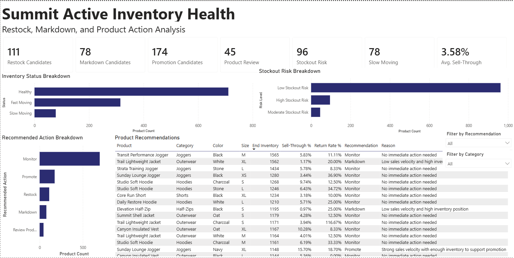

# Summit Active Analytics Platform

## Project Overview

The Summit Active Analytics Platform is a retail and ecommerce analytics project for a mock premium athleisure brand. The project is designed to help ecommerce, sales planning, merchandising, and inventory teams understand business performance, product trends, inventory health, and recommended product actions.

This project focuses on building an internal analytics product rather than a customer-facing ecommerce storefront. It combines SQL, PostgreSQL, Python, and Power BI to turn mock retail data into business intelligence dashboards and decision-support recommendations.

## Case Study

A detailed case study explaining the business problem, dashboard design, data model, recommendation logic, and project decisions is available here:

[Read the full case study](docs/case_study.md)

## Mock Brand

**Summit Active** is a mock premium athleisure company selling performance-focused lifestyle apparel across ecommerce, retail, and wholesale channels.

Example product categories include:

- Joggers
- Hoodies
- Performance Tees
- Shorts
- Leggings
- Half-Zips
- Outerwear
- Polos
- Tanks
- Accessories

## Business Problem

Retail and ecommerce teams need clear visibility into which products are performing well, which products are at risk of stocking out, and which products are sitting in inventory too long.

Without a centralized analytics tool, teams may struggle to answer questions such as:

- Which categories are driving the most revenue?
- Which products have the best gross margin?
- Which items are slow-moving?
- Which products should be restocked?
- Which products may need markdowns?
- Which products have high return rates?
- Which sales channels are performing best?

This project solves that problem by creating a structured analytics workflow and Power BI dashboard for sales, product, inventory, and recommendation analysis.

## Tech Stack

- **PostgreSQL** — relational database for mock retail data
- **SQL** — schema design, analytics queries, and business logic
- **Python** — mock data generation and data loading
- **Pandas / NumPy / Faker** — synthetic data creation
- **Power BI** — dashboarding and business intelligence reporting
- **Docker** — local PostgreSQL database environment
- **GitHub** — version control and portfolio presentation

## Dashboard Pages

### 1. Executive Overview

The Executive Overview page provides a high-level view of company performance.

Key metrics and visuals include:

- Total revenue
- Gross profit
- Gross margin %
- Units sold
- Total orders
- Average order value
- Revenue by month
- Gross profit by category
- Revenue by region
- Revenue by channel



### 2. Product Performance

The Product Performance page helps merchandising and ecommerce teams understand product and category performance.

Key metrics and visuals include:

- Product revenue
- Gross profit
- Units sold
- Product count
- Return rate
- Gross margin %
- Top products by revenue
- Revenue by category
- Gross margin % by category
- Return reason breakdown



### 3. Inventory Health

The Inventory Health page provides decision-support recommendations for inventory and merchandising teams.

Key metrics and visuals include:

- Restock candidates
- Markdown candidates
- Promotion candidates
- Product review candidates
- High stockout risk products
- Slow-moving products
- Average sell-through rate
- Inventory status breakdown
- Stockout risk breakdown
- Recommended action breakdown
- Product-level recommendation table
- Recommendation and category slicers



## Data Model

The project uses mock data across the following core tables:

### Products

Product-level information including product name, category, gender, color, size, season, unit cost, retail price, launch date, and product status.

### Customers

Mock customer information including customer segment, region, email, and account creation date.

### Orders

Order-level information including order date, customer, sales channel, region, order status, and total order amount.

### Order Items

Line-item transaction data connecting products to orders, including quantity, unit price, unit cost, discount amount, net sales, and gross profit.

### Inventory Snapshots

Monthly inventory snapshots showing starting inventory, ending inventory, units received, and units sold.

### Returns

Return-level information including returned product, return reason, return date, quantity returned, and refund amount.

### Marketing Campaigns

Mock campaign data including campaign channel, spend, target category, campaign dates, and campaign goal.

## Key Metrics

The platform tracks core retail and ecommerce metrics, including:

- Revenue
- Units sold
- Gross profit
- Gross margin %
- Average order value
- Return rate
- Sell-through rate
- Inventory aging
- Stockout risk
- Markdown candidate flag
- Restock candidate flag
- Revenue by channel
- Revenue by region
- Revenue by category
- Product recommendation action

## Recommendation Logic

The inventory recommendation system assigns product-level actions based on sales velocity, inventory position, return behavior, and stockout risk.

Recommended actions include:

- **Restock** — strong sales velocity with relatively low inventory
- **Markdown** — low sales velocity with high inventory position
- **Promote** — strong sales velocity with enough inventory to support promotion
- **Review Product Experience** — high return rate that may indicate sizing, quality, or expectation issues
- **Monitor** — no immediate action needed

This logic is implemented in SQL views and surfaced in Power BI as an interactive decision-support dashboard.

## Project Structure

```text
athleisure-analytics-platform/
│
├── data/
│   ├── raw/
│   ├── processed/
│   └── generated/
│
├── docs/
│   ├── project_brief.md
│   ├── metrics_dictionary.md
│   ├── powerbi_dashboard_plan.md
│   └── case_study.md
│
├── powerbi/
│   ├── summit_active_dashboard.pbix
│   └── screenshots/
│       ├── executive_overview.png
│       ├── product_performance.png
│       └── inventory_health.png
│
├── scripts/
│   ├── generate_mock_data.py
│   └── load_mock_data.py
│
├── sql/
│   ├── schema.sql
│   ├── analysis_queries.sql
│   ├── create_views.sql
│   └── update_recommendation_logic.sql
│
├── docker-compose.yml
├── requirements.txt
└── README.md
```

## How to Run Locally

### 1. Clone the repository

```bash
git clone <https://github.com/Gavin-Cote/athleisure-analytics-platform>
cd athleisure-analytics-platform
```

### 2. Start PostgreSQL with Docker

```bash
docker compose up -d
```

### 3. Create and activate a virtual environment

On Windows Git Bash:

```bash
python -m venv .venv
source .venv/Scripts/activate
```

### 4. Install Python dependencies

```bash
pip install -r requirements.txt
```

### 5. Generate mock data

```bash
python scripts/generate_mock_data.py
```

### 6. Load mock data into PostgreSQL

```bash
python scripts/load_mock_data.py
```

### 7. Create analytics views

```bash
docker exec -i athleisure_postgres psql -U athleisure_user -d athleisure_db < sql/create_views.sql
```

### 8. Apply updated recommendation logic

```bash
docker exec -i athleisure_postgres psql -U athleisure_user -d athleisure_db < sql/update_recommendation_logic.sql
```

### 9. Open Power BI

Open:

```text
powerbi/summit_active_dashboard.pbix
```

If needed, refresh the Power BI report using the local PostgreSQL connection.

Connection settings:

```text
Server: localhost:5433
Database: athleisure_db
Username: athleisure_user
Password: athleisure_password
```

## Example Business Insights

The dashboard is designed to surface insights such as:

- Joggers and hoodies are among the strongest revenue-driving categories.
- Ecommerce contributes the largest share of channel revenue.
- Some products have strong sales velocity and available inventory, making them good promotion candidates.
- Products with high inventory and low sales velocity are flagged as markdown candidates.
- Products with elevated return rates are flagged for product experience review.
- Inventory teams can use the dashboard to identify restock, markdown, promotion, and stockout risk opportunities.

## Skills Demonstrated

This project demonstrates skills in:

- SQL analytics
- PostgreSQL database design
- Data modeling
- Business intelligence
- Power BI dashboard development
- Retail analytics
- Ecommerce analytics
- Inventory analysis
- Product performance analysis
- KPI development
- Recommendation logic
- Python data generation
- Translating business problems into analytics tools

## Future Improvements

Potential future improvements include:

- Add dbt models for a more production-like analytics workflow
- Add customer segmentation analysis
- Add marketing campaign ROI analysis
- Build a Streamlit internal analytics app
- Add demand forecasting using Python
- Add markdown optimization logic
- Add more realistic seasonality and product launch behavior
- Add automated data quality tests
- Add a portfolio case study page with screenshots and business explanation

## Portfolio Positioning

This project was built to demonstrate the ability to combine technical analytics skills with retail and ecommerce business thinking. It is relevant to roles such as:

- Ecommerce Analyst
- Product Analyst
- Business Intelligence Analyst
- Retail Analytics Intern
- Sales Planning Analyst
- Data Analyst
- Analytics Product Manager
- Merchandising Analytics Intern